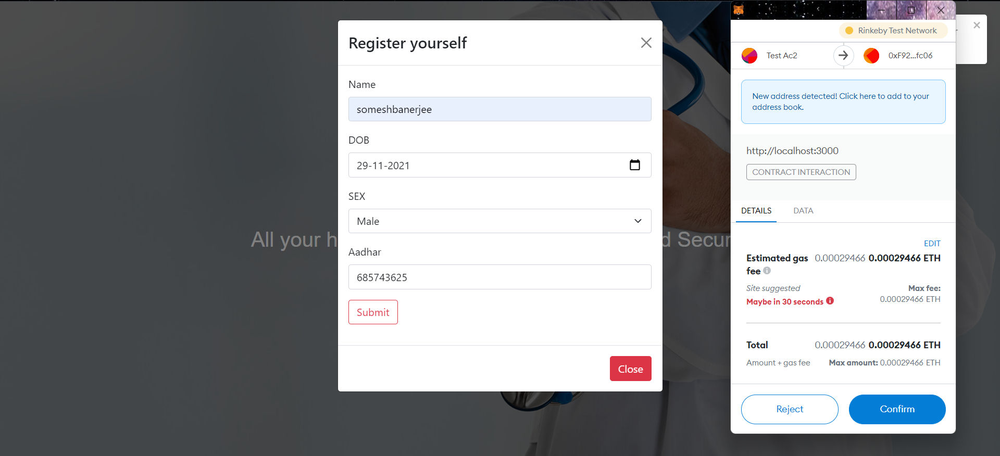
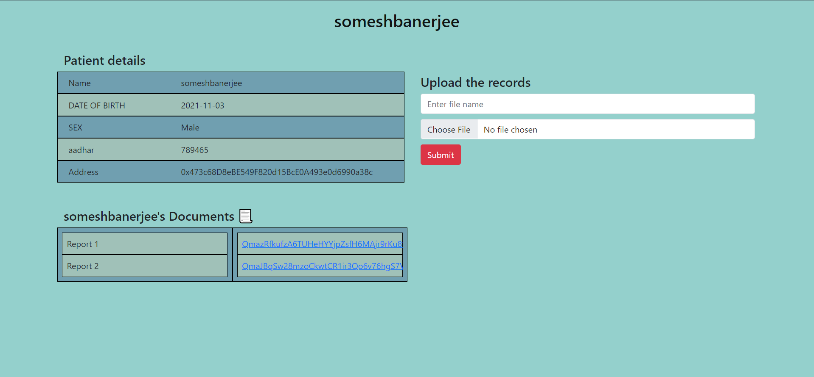

<h1 align="center">Hospital-Records-Blockchain</h1>

Build at: [**HACKFORTOMORROW HACKATHON**](https://hackfortomorrow.devfolio.co/)


## Table of Contents:
- [Introduction](#Introduction)
- [To Run on Localhost](#LocalImplementation)
- [Technology Stack](#Technology-Stack)
- [Features](#Features)
- [Screenshots and Video](#ScreenshotsandVideo)
- [Contributors](#Contributors)

## Introduction
Managing Patient documents across different Hospital is quite hassling. This Dapp, Hospital Blockchain Records helps in maintaining Patient's Medical history. 
Only Hospital authority has the priviledge to upload  Medical documents for the patients registered in our system. For storing the files, we have used IPFS, which
is a peer-to-peer distributed system.

## Local Implementation
1. Clone the Repo and istall dependencies
```
https://github.com/somesh-banerjee/Hospital-Records-Blockchain.git
cd Hospital-Records-Blockchain/frontend/
npm install
```
2. Create a [Infura](https://infura.io/) account and create a new project. Now copy the Project ID from settings Tab and paste it in the marked location in `/ethereum/web3.js` and `/ethereum/deploy.js` files.
3. Install metamask in your browser and log into your metasmask account.
4. Run the local webserver with any port.
```
npm start
```


## Technology Stack
1) Ethereum Blockchain
2) Solidity
3) Web3 JS
4) IPFS
5) Metamask Wallet
6) React JS

## Features
1) 
2) 


## Screenshots and Video






## Contributors:

Team Name: cryptocoders

* [Somesh Banerjee](https://github.com/somesh-banerjee)
* [Sayatan Roy](https://github.com/Roy6250)
* [Vivek Kumar](https://github.com/freakfan15)
* [Rishi Sounak]()
